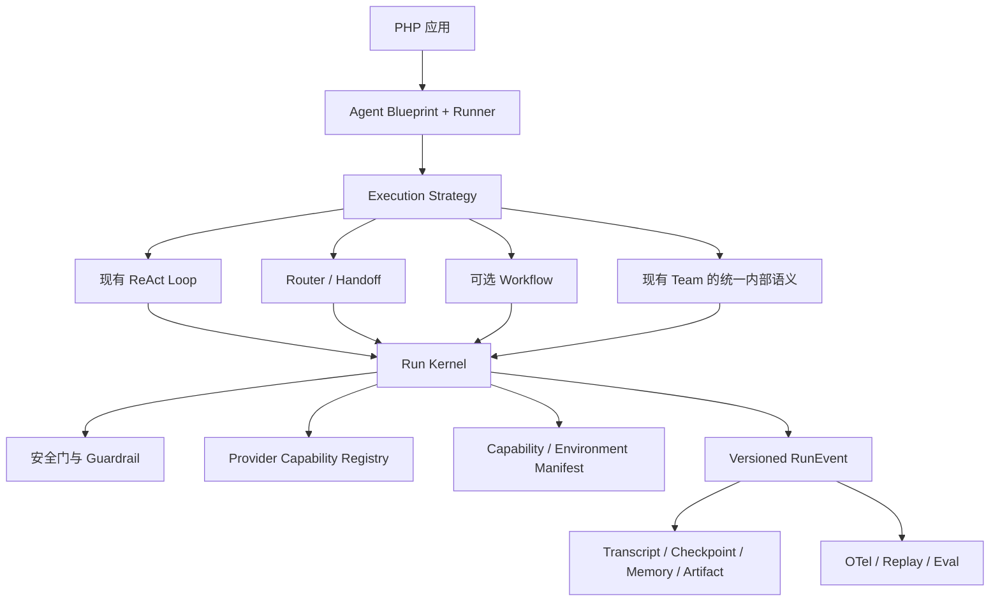

# Hao Code 产品路线图

- 状态：执行中（P0 代码验收完成；外部 Provider 实测单独记录）
- 更新日期：2026-08-14
- 规划周期：从路线图启动起计算 12 个月

本文说明 Hao Code 未来一年的产品方向、架构边界和验收门槛。它不承诺具体版本号或发布日期。每个阶段只有通过验收，才能进入下一阶段。

## 愿景

Hao Code 要成为面向 PHP 应用的生产级 Agent Runtime SDK：

- 保持 framework-free，不要求 Laravel、Symfony 或其他应用框架。
- 通过组合支持不同 Agent，而不是为每种 Agent 建一套顶层 API。
- 默认安全。权限、预算、沙箱和 Provider 能力都不能在子 Agent 或 Handoff 中扩大。
- 可以从中断和进程崩溃中恢复，并明确处理无法确认结果的外部副作用。
- 每次运行都能观察、回放并沉淀为回归测试。
- 公共 API 稳定，内部运行时可以持续演进。

Hao Code 的定位是「PHP 生产级 Agent Runtime SDK」，不是 PHP 版 LangGraph，也不是内置控制台、向量数据库和托管服务的一体化平台。

## 当前基础

Hao Code 已经具备以下生产基础：

- Framework-free PHP SDK，以及稳定的 `Agent`、`Runner`、`Conversation` 和 `HaoCode` 公共入口。
- Anthropic、OpenAI Responses API、OpenAI Chat Completions 兼容网关。
- Tool、Skill、Streaming、图片输入、结构化输出、多轮会话和 Agent Team。
- Human-in-the-loop 中断与恢复、Abort、成本和预算控制。
- Local、Tokimo、AgentRun 沙箱。
- 默认非只读的工具权限模型，以及对子 Agent 能力扩大的限制。
- Session 锁、损坏检测、资源清理和 SDK 公共 API 快照检查。

当前运行时仍以固定 Agent Loop 为核心。它适合单 Agent、Agent-as-tool 和现有 Team 场景，但还缺少支持多种执行语义所需的统一事件、状态、恢复和能力协商基础。

## 框架对比结论

本路线图参考 `~/workspace/agent` 下 25 个本地框架快照。调研以代码入口、状态处理、恢复语义和扩展边界为准，不把 README 功能列表当作生产能力证明。

| 框架类别 | 代表项目 | 优势 | 局限 | Hao Code 的取舍 |
| --- | --- | --- | --- | --- |
| PHP 框架集成 | Laravel AI | Queue、Broadcast、数据库会话和 Fake 测试体验完整 | 强绑定 Laravel | 只提供可选适配器，不把框架依赖放进核心 |
| PHP 契约设计 | Symfony AI | Provider、Capability、Contract 和 Router 分层清楚 | Bridge 数量容易膨胀；MultiAgent 更接近路由 | 借鉴能力协商和接口边界，控制包数量 |
| PHP Workflow | Neuron AI | Workflow、HITL、中断恢复覆盖较全 | Agent 继承 Workflow，PHP 对象序列化增加升级和安全成本 | 借鉴快照语义，不照搬继承和对象序列化 |
| 图运行时 | LangGraph、Burr | 状态图、Checkpoint、Fork 和恢复成熟 | 概念较重，容易把 SDK 变成工作流平台 | 借鉴事件与增量 Checkpoint，不引入 Pregel |
| Pipeline | Haystack | 类型化组件 DAG、快照和评估成熟 | Pipeline-first，不适合作为所有 Agent 的公共抽象 | 借鉴组件输入输出契约 |
| 类型与评估 | PydanticAI、DSPy | 类型化依赖、结构化结果、OTel 和 Eval 较强 | Python 类型系统难直接移植；DSPy 不是运行时 | 加强 PHP DTO、Schema 和 Eval，不做 Prompt 优化器 |
| 厂商 SDK | OpenAI Agents、ADK | Agent/Runner/Session/Event 边界清楚，Handoff 和 Guardrail 语义明确 | Provider 或模型生态偏向明显 | 借鉴语义，不向公共 API 泄漏厂商 Wire Format |
| 企业框架 | Microsoft Agent Framework、Semantic Kernel | Provider、MCP、A2A、Checkpoint、HITL 和 OTel 覆盖广 | API 面较大，历史抽象并存 | 借鉴协议与追踪能力，不追求同等广度 |
| 多 Agent | Agno、CrewAI、CAMEL | Team、Role、Task Ledger 和动态 Worker 丰富 | 容易形成 Crew、Flow、Team 多套心智模型 | 保留现有 Team API，后续统一内部运行语义 |
| 轻量 Agent | BeeAI、smolagents | ReAct 和 agents-as-tools 简单透明 | 状态多在进程内，崩溃恢复和权限边界较弱 | 保持开发体验简单，同时补齐恢复和权限证明 |
| 组合运行时 | DeepAgents | Middleware、Backend、Profile、Subagent、Checkpoint 和 Eval 组合较好 | 依赖 LangGraph，中间件顺序成为隐含契约 | 借鉴受保护中间件和增量状态 |
| 平台型 | Mastra | Agent、Workflow、Memory、Store、Server 和 Observability 覆盖全面 | 平台面积大，非幂等步骤的恢复需要额外约束 | 划清 SDK、Worker 和平台边界，不做一体化平台 |
| 专项框架 | browser-use、OpenHands software-agent-sdk | Browser、Workspace 和 Server 分层深入 | 专项能力不等于通用 Agent Runtime | 把 Browser 和 Workspace 作为环境适配器 |
| 记忆型 | Letta | 记忆分区思路清楚 | 本地快照主要是旧 V1 Server | 只借鉴状态域分离 |

完整仓库清单见文末。

## 目标架构

「支持不同 Agent」不等于建立 `CodingAgent`、`DataAgent`、`WorkflowAgent` 等继承树。Agent 应当通过以下维度组合：

- **Agent Blueprint**：模型、指令、工具、Skill、策略和预算。
- **Run Context**：输入、依赖、状态、取消信号和资源。
- **Execution Strategy**：现有 Loop、Router/Handoff，以及经过验证后才加入的 Workflow 或 Team 策略。
- **Environment**：Host、Sandbox、Remote、Browser。
- **State Stores**：Transcript、Checkpoint、Memory、Artifact。
- **Policy**：不可绕过的安全门，以及可配置的业务 Guardrail。

`ExecutionStrategy` 初期只作为内部接口。现有 Agent Loop 仍是默认实现。在三类真实业务无法用现有组合方式表达之前，不冻结公共 Workflow API。

## 战略主线

未来一年集中投入三条主线。

### 1. 能力与运行环境可验证

在运行前计算 Agent、Provider、Model、Tool、Sandbox 和 Permission 的有效能力。系统应尽早拒绝不支持的组合，并给出可操作的错误。

### 2. Agent Run 可以安全恢复

Checkpoint 只写在安全边界。系统要区分已提交结果、可以重试的失败，以及结果无法确认的外部副作用。Hao Code 只承诺 at-least-once，不宣称 exactly-once。

### 3. 运行记录可以转成质量证据

统一事件需要支持追踪、离线回放和 Eval。真实故障应转成固定测试数据，阻止同类问题再次发布。

## 现有能力架构收口队列

这组工作不增加业务功能，也不承诺新的公共 API。目标是理顺现有调用链，统一重复规则，并为每条内部契约补齐回归证据。每个编号单独实施和验收，不能为了抽象完整而合并成一次大改。

执行约束：

- 一个批次只处理一条不变量。先写契约表，再改实现。
- 保留 `Agent`、`Runner`、`SdkTool`、`RunOptions` 等公共入口，通过内部适配器逐步收口。
- 真实组装链、失败路径、取消、权限和资源边界必须进入测试。只测新类不算完成。
- 未通过公共 API 快照、全量测试和兼容检查的切片，不能标记完成。

| 编号 | 当前问题 | 目标不变量 | 验收门槛 | 状态 |
| --- | --- | --- | --- | --- |
| C1 文本读取 | Host、Local Sandbox、Remote Sandbox 各自处理行扫描、限制和错误 | 三条文本读取路径共用一套有界扫描规则；Backend 只提供字节，Tool 负责路径、内容类型、展示和读取凭证 | 三条路径的行数、窗口、换行、超长行、超大输出和取消语义一致；失败或取消不能留下读取凭证 | 已完成：纳入 v1.19.9 发布基线 |
| C2 通用 Agent 与 Coding Preset | `ContextBuilder` 同时承担通用运行上下文和 Git、`AGENTS.md`、Skill、编码规则注入 | Agent Kernel 只处理通用上下文；Coding Preset 负责编码场景信息 | 现有 Coding Agent 提示词保持兼容；非编码 Agent 不再自动携带编码规则；Provider 请求结构不变 | 第一切片完成：Coding Preset 责任已独立并纳入 v1.19.9；新的非编码选择入口待独立契约确认 |
| C3 Tool 结果 | `SdkTool::handle(): string` 与内部结构化结果、错误、取消和元数据并存 | 内部执行链只认 `ToolResult`；`handle(): string` 仅在 SDK 兼容边界适配 | 文本、错误、取消、元数据、截断和读取凭证都保真；自定义 `SdkTool` 无需改代码 | 待开始 |
| C4 Run 配置 | `Agent`、`RunOptions`、`HaoCodeConfig` 重复表达模型、预算、超时和工具范围 | 内部只有一个 Canonical RunSpec；Run Limits 只有一个归一化入口 | 同一输入在所有入口得到相同有效配置；默认值和覆盖顺序有矩阵测试；公共构造函数不变 | 待开始 |
| C5 Agent 调用与资源范围 | Root Agent、子 Agent、`AgentAsTool` 的预算、取消、结果和生命周期分散在多条链路 | 内部调用契约统一表达输入、生命周期和结果；子调用的权限、预算、目录、沙箱和 Provider 能力只取父子交集 | Root、子 Agent、`AgentAsTool` 和 Team 跑同一组能力收缩测试；任何子调用都不能扩大父级资源 | 待 C4 完成后开始 |
| C6 消息与提示片段 | Anthropic-shaped 消息数组同时承担模型输入、界面显示、持久化、追踪和缓存标记 | 内部 Message Envelope 明确可见范围和持久化语义；Prompt Fragment 明确来源、稳定范围、敏感级别和内容 | Provider 适配层仍接收统一的 Anthropic-shaped 契约；缓存、脱敏、持久化和回放各有故障测试 | 待 C3、C4 稳定后开始 |
| C7 Tool Registry 身份 | 同名注册会覆盖旧工具，动态 `name()` 可能与注册键不一致 | 先固定并测试现有行为，再决定注册身份和显式替换规则；不能顺带改变运行时组装语义 | 覆盖重复注册、Sandbox 替换、子 Registry 克隆、动态 Schema 和动态名称；若改变行为，必须写兼容说明 | 延后，独立切片处理；不属于 C1 当前改动 |
| C8 Glob/Grep 文件能力 | Host 与 Sandbox 的搜索工具仍有相似规则，但 Backend 能力和输出格式并不完全相同 | 先列出差异，只统一已有的路径、边界和错误规则；没有重复不变量时不建通用 Filesystem 接口 | Host、Local、AgentRun、Tokimo 的现有能力矩阵完整；不能为了统一而降低任一 Backend 能力 | 待 C1 发布后评估，不自动启动 |

推荐顺序是先完成 C1，再处理 C2 和 C3。C4、C5 负责收口运行配置与调用生命周期。C6 只有在工具结果和运行配置稳定后才开始。C7、C8 都要先补行为刻画测试，不能直接从抽象设计起步。

## 12 个月路线图

### P0：0 至 2 个月，建立生产契约

状态：代码验收完成（2026-08-12）。Mock/fixture 结果不作为外部 Provider 实测证明。

内部依赖方向见 [Runtime dependency rules](architecture/runtime-dependencies.md)。

交付内容：

- 建立内部 Provider Registry。
- 描述 Provider、Model、Endpoint 三级 Capability。
- 计算 Agent、Tool、Provider、Sandbox 和 Permission 的有效能力清单。
- 建立 Conformance Test Kit，覆盖文本、Tool Call、多轮 Tool、结构化输出、Thinking、Abort、超时、流中断和畸形事件。
- 定好核心内部依赖方向，不修改现有公共构造函数。

验收门槛：

- 公共 API 快照没有破坏性变化。
- 至少有 20 个故障 Fixture。
- 不支持的组合在发出网络请求前失败。
- 三类现有 Provider 全部进入同一能力矩阵。

验收记录（2026-08-12）：

- `ProviderRegistry` 已接管 `StreamingClient` 的三类 Provider 分发；Provider、Model、Endpoint 使用同一能力注册表解析。
- 运行前会预检 Agent、Tool、Provider、Sandbox、Permission；组装后由同一个 Run Guard 绑定真实 `ToolRegistry`，每次运行时配置变更和 Provider 请求前再次校验，失败的变更整体回滚。
- `SettingsManager` 是运行时 Provider 身份唯一事实源；`StreamingClient`、Credential Pool、Capability 和成本上下文都在请求边界读取当前身份，切换 `active_provider` 不再携带上一 Provider 的凭据、模型或端点。
- Conformance Test Kit 对三类 Provider 运行相同的正常路径和故障类别；故障目录共有 33 个版本化回归 Fixture，每类 Provider 11 个，覆盖 HTTP 错误、Provider 流错误、传输中断、超时、超大 SSE、畸形 JSON 和非对象 JSON。
- `php scripts/sdk-bc-check.php --verify` 通过，没有修改公共构造函数或破坏 SDK API 快照。
- `./vendor/bin/phpunit tests/Provider`、P0 专项测试和 `composer test` 必须同时通过；外部 Provider 实测仍按凭据和网络条件单独执行，不能用 Mock Fixture 代替发布声明。

### P1：2 至 4 个月，建立事件与状态基础

交付内容：

- 定义内部版本化 `RunEvent`，包含 `run_id`、序号、因果关系、阶段、去重键和 Schema Version。
- 明确 Transcript、Checkpoint、Memory、Artifact 的所有权。
- 让现有 JSONL Session 通过 Store Adapter 接入，不立刻替换已有存储。
- 提供只读事件导出和离线 Replay 原型。
- Checkpoint 按增量写入，避免反复复制完整消息历史。

验收门槛：

- 使用录制的 Provider 和 Tool 结果可以离线重建一次运行。
- Replay 不执行真实副作用。
- 至少两个事件消费者无需修改核心即可接入。
- 老 Session 数据仍然可读。

### P2：4 至 7 个月，支持安全恢复

交付内容：

- 只在副作用执行前和结果提交后写 Checkpoint。
- 为 Tool Call 加入幂等键、Lease、Fencing Token 和 Claim 状态。
- 明确 `completed`、`failed`、`interrupted`、`cancelled`、`unknown`。
- 提供一个数据库型 Checkpoint Store。
- 定义 Worker 崩溃恢复协议。

验收门槛：

- 在模型、Tool、HITL 边界注入 100 次 Kill/Retry。
- 已提交的有副作用工具不重复执行。
- 两个 Worker 可以安全竞争同一个 Run。
- 无法确认外部副作用时进入 `unknown`，不能自动重试。
- HITL 恢复继续兼容当前公共 API。

### P3：7 至 9 个月，安全组合不同 Agent

交付内容：

- 引入内部 `ExecutionStrategy`，现有 Loop 作为默认实现。
- 定义 `HandoffRequest` 和 Router，明确区别于 `AgentAsTool`。
- 为输入、模型输出、工具调用和 Handoff 提供 Guardrail。
- 分开不可绕过的安全门与可配置业务 Guardrail。
- Handoff 继承 Trace 和 Cancel，但权限、预算、沙箱和 Provider 能力只取交集。

验收门槛：

- Handoff 不能扩大工具权限、预算、Provider 能力或沙箱范围。
- `AgentAsTool` 和现有 Team API 保持兼容。
- Router Agent、Coding Agent 和长会话 Agent 共用一个 Run Kernel。

### P4：9 至 12 个月，形成质量飞轮与生态接入

交付内容：

- 打通 Trace、Replay 和 Eval。
- 从真实失败中沉淀不少于 20 个回归数据集。
- 以薄适配器方式接入 Laravel Queue 和 Symfony Messenger。
- 从 MCP、A2A、AG-UI 中选择一个完成实验性端到端适配。
- 建立 Durable Worker Chaos Prototype。

验收门槛：

- Eval 在发布前捕获至少一次真实退化。
- 至少两个第三方适配器无需修改核心即可实现。
- Worker 只有在 Lease、Fencing、幂等和 `unknown` 副作用测试全部通过后，才能标记稳定。
- 如果没有三个真实项目证明现有组合方式不足，不启动通用 Workflow Engine。

## 参考 Agent 验收集

路线图持续使用五类 Agent 检验公共抽象：

1. Coding Agent：沙箱、文件、Bash、审批和 Abort。
2. 数据分析 Agent：只读工具、结构化输出和严格预算。
3. 客服 Agent：长会话、持久 Transcript 和业务 Guardrail。
4. Router/Handoff Agent：多专家协作，不能扩大权限。
5. 长任务 Agent：Worker 崩溃后恢复，不盲目重放外部副作用。

五类 Agent 都应使用同一个 `Agent + Runner` 公共模型。若实现它们需要五套顶层 API，说明抽象需要重新设计。

## 项目指标

- **兼容**：现有 v1 公共 API 没有破坏性变化。
- **安全**：Handoff 和子 Agent 不扩大权限。
- **恢复**：已提交工具结果不重复执行；不确定副作用全部进入 `unknown`。
- **验证**：至少有 20 个版本化故障回归 Fixture，发布前自动执行 Replay 和 Eval；真实事故样本必须标明来源和脱敏方式。
- **扩展**：三个外部适配器作者中，至少两人能在不修改核心的情况下完成接入。
- **状态开销**：Checkpoint 随增量增长，不重复保存完整消息历史。
- **观察**：模型、工具、审批和 Handoff 都有统一 `run_id` 与因果链。

## 明确不做

以下内容不进入当前 12 个月核心路线图：

- PHP 版 Pregel 或完整 LangGraph 克隆。
- 内置 Studio、控制台或托管平台。
- 向量数据库与 RAG Connector 大全。
- Prompt 自动优化器。
- 在同步 Runner 中加入实时语音运行时。
- 为每个垂直场景建立 Agent 子类。
- 向公共 API 暴露 Provider Wire Format 或内部 Agent Loop。
- 在没有独立安装需求前拆分大量 Composer 包。
- 对外宣称 Exactly-once。

Browser、数据分析、语音和远程 Workspace 等专项能力应通过 Adapter 或 Profile 接入，不扩大核心运行时。

## 决策门槛

- 新抽象先在内部使用，再由至少三个真实应用验证，最后决定是否公开。
- 公共 API 变更必须遵守 [SDK 向后兼容策略](sdk-bc-policy.md)。
- 每个阶段先补故障测试，再改变运行语义。
- Durable Worker、Workflow 和互操作协议先标记实验性。只有通过对应的恢复、权限和兼容测试后，才能转为稳定能力。
- 路线图每三个月复核一次。复核依据是测试证据、真实项目反馈和运维故障，不按框架功能数量调整方向。

## 本地调研仓库

本路线图参考以下本地代码快照：

- `adk-js`、`adk-python`
- `agent-framework`、`semantic-kernel`
- `openai-agents-js`、`openai-agents-python`
- `langgraph`、`burr`、`haystack`
- `pydantic-ai`、`dspy`
- `laravel-ai`、`symfony-ai`、`neuron-ai`、`llphant`
- `agno`、`crewai`、`camel`、`beeai-framework`、`smolagents`、`deepagents`
- `mastra`、`letta`、`browser-use`、`software-agent-sdk`
